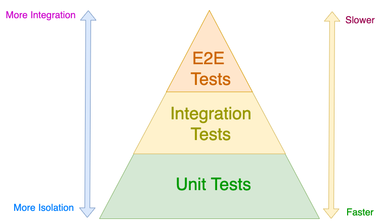

# Unit Tests
## Definition
Unit testing is a software testing method where individual units or components are tested to determine whether they are fit for use. 
Unit Tests isolate a section of code and verify its correctness. A unit may be an individual function, method, procedure, module, 
or object.

## Advantages
1.  Isolate each part of the program and show that the individual parts are correct.
2.  Provides a strict, written contract that the piece of code must satisfy.
3.  Finds problems early in the development cycle. 
4.  Allows the programmer to refactor code or upgrade system libraries at a later date, and make sure the module still works correctly.
5.  Reduce uncertainty in the units themselves and can be used in a bottom-up testing style approach. 
6.  Provides a sort of living documentation of the system.
7.  Embody characteristics that are critical to the success of the unit.

## Limitations and disadvantages
1. Testing will not catch every error in the program.
2. Tests the functionality of the units themselves. It will not catch integration errors or broader system-level errors.
3. It is difficulty of setting up realistic and useful tests.

## Manual vs. Automated testing
It's important to make the distinction between manual and automated tests. Manual testing is done in person, by clicking through the 
application or interacting with the software and APIs with the appropriate tooling. This is very expensive since it requires someone to setup 
an environment and execute the tests themselves, and it can be prone to human error as the tester might make typos or omit steps in the test script.

Automated tests, on the other hand, are performed by a machine that executes a test script that was written in advance. These tests can vary in complexity, 
from checking a single method in a class to making sure that performing a sequence of complex actions in the UI leads to the same results. It's much more 
robust and reliable than manual tests – but the quality of your automated tests depends on how well your test scripts have been written.

## Types Of tests

### Unit tests

Unit tests are very low level and close to the source of an application. They consist in testing individual methods and functions of the classes, components, 
or modules used by your software. Unit tests are generally quite cheap to automate and can run very quickly by a continuous integration server.

### Integration tests

Integration tests verify that different modules or services used by your application work well together. For example, it can be testing the interaction with 
the database or making sure that microservices work together as expected. These types of tests are more expensive to run as they require multiple parts of the 
application to be up and running.

### Functional tests

Functional tests focus on the business requirements of an application. They only verify the output of an action and do not check the intermediate states of the 
system when performing that action.

There is sometimes a confusion between integration tests and functional tests as they both require multiple components to interact with each other. The difference 
is that an integration test may simply verify that you can query the database while a functional test would expect to get a specific value from the database as defined 
by the product requirements.

### End-to-end tests

End-to-end testing replicates a user behavior with the software in a complete application environment. It verifies that various user flows work as expected and can be 
as simple as loading a web page or logging in or much more complex scenarios verifying email notifications, online payments, etc...

End-to-end tests are very useful, but they're expensive to perform and can be hard to maintain when they're automated. It is recommended to have a few key end-to-end 
tests and rely more on lower level types of testing (unit and integration tests) to be able to quickly identify breaking changes.

### Acceptance testing

Acceptance tests are formal tests that verify if a system satisfies business requirements. They require the entire application to be running while testing and focus on 
replicating user behaviors. But they can also go further and measure the performance of the system and reject changes if certain goals are not met.

### Performance testing

Performance tests evaluate how a system performs under a particular workload. These tests help to measure the reliability, speed, scalability, and responsiveness of an 
application. For instance, a performance test can observe response times when executing a high number of requests, or determine how a system behaves with a significant 
amount of data. It can determine if an application meets performance requirements, locate bottlenecks, measure stability during peak traffic, and more.

### Smoke testing

Smoke tests are basic tests that check the basic functionality of an application. They are meant to be quick to execute, and their goal is to give you the assurance 
that the major features of your system are working as expected.

Smoke tests can be useful right after a new build is made to decide whether or not you can run more expensive tests, or right after a deployment to make sure that they 
application is running properly in the newly deployed environment.

## Test Pyramid
The "Test Pyramid" is a metaphor that tells us to group software tests into buckets of different granularity. It also gives an idea of how many tests we should have 
in each of these groups.

### Unit Tests

Unit tests can only find logical errors at the most fundamental level. They are fast and require very few resources to run.

### Integration Tests

Integration tests verify that services and databases work well together with the code and the classes you’ve written. They can only find problems at the interfaces where 
two or more components meet. Third party components will be faked.

### E2E Tests
E2E tests depend on the complete application being able to start. These are the most comprehensive type of tests we have and, accordingly, need the most computing
resources and time to run. Third party components will be faked.

[Getting Started](UnitTest_Getting_Started.md)
